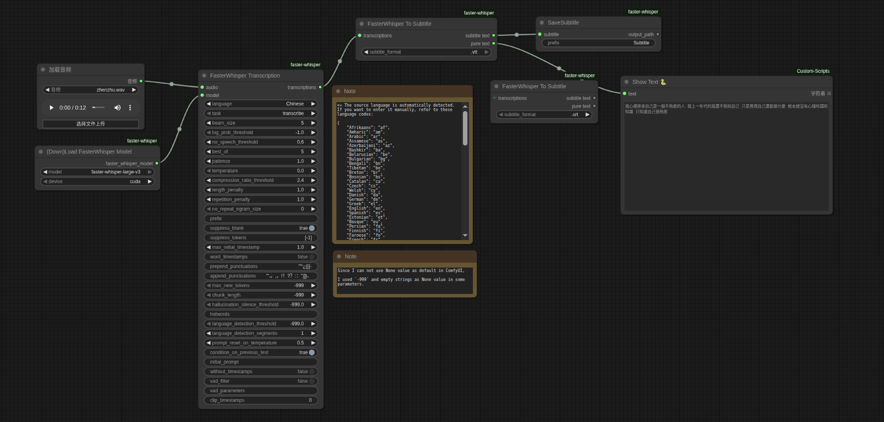

# ComfyUI-faster-whisper
[ComfyUI](https://github.com/comfyanonymous/ComfyUI) reference implementation for [faster-whisper](https://github.com/SYSTRAN/faster-whisper). Workflow that generates subtitles is included. 

# Example Workflows
Subtitle generation workflow is included in [workflows](./workflows) directory




# Installation

1. git clone repository into `ComfyUI\custom_nodes\`
```
https://github.com/wangweihong/ComfyUI-faster-whisper.git
```

2. Go to `ComfyUI\custom_nodes\ComfyUI-faster-whisper` and run
```
pip install -r requirements.txt
```

If you are using the portable version of ComfyUI, do this:
```
python_embeded\python.exe -m pip install -r ComfyUI\custom_nodes\ComfyUI-faster-whisper\requirements.txt
```

## Available Models
This repo uses Systran's [faster-whisper models](https://huggingface.co/Systran).<br>
Running the [workflow](./workflows/faster_whisper_suttitle.png) will automatically download the model into `ComfyUI\models\faster-whisper`. 

If you want to place it manually, download the model from Systran's [faster-whisper models](https://huggingface.co/Systran) and place it in `ComfyUI\models\faster-whisper`.


# Changes to the Original Project

This project has made the following modifications to the [original repository](https://github.com/jhj0517/ComfyUI-faster-whisper):
1. Optimized Input Nodes: Added support for directly loading audio files rather than write a filepath.
2. Enhanced `FastWhisper To Subtitle`Node: 
    1. Added a pure text output option that generates plain text transcription without timestamps. It can link to `ShowText` Node to see output text directly   
3. Improved Language Selection: The "Language" parameter now supports dropdown menu operation for easier selection.

# Notice
To improve the accuracy of speech recognition, the following modifications are recommended:
1. Resample the input audio to 16000Hz using the `Audio Resampled` node from `comfy_mtb`
2. Set `vad_filter` to true
3. Increase the value of `no_speech_threshold`
